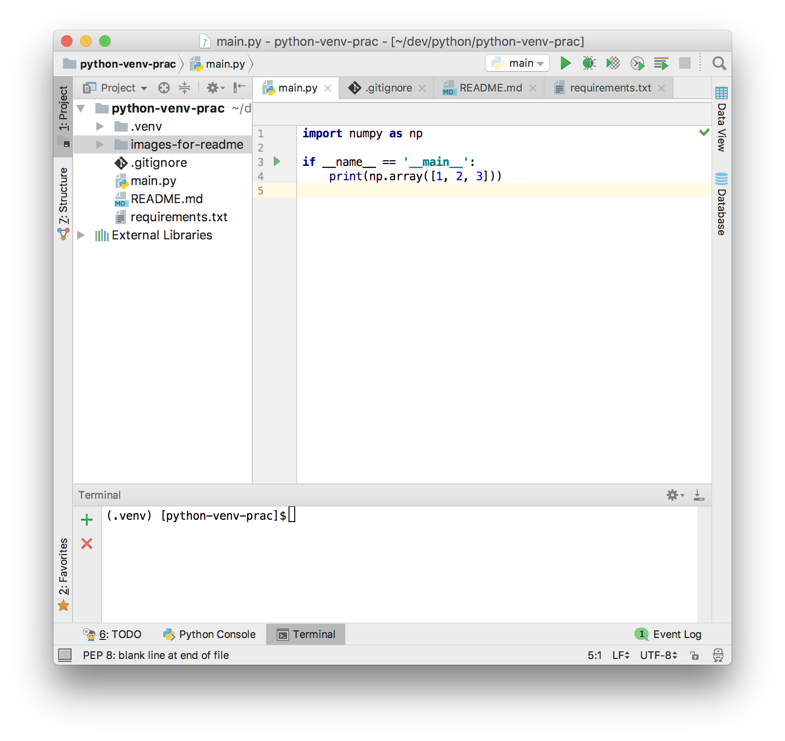

# Practice of venv in Python
 
## Purpose

The purpose is to practice venv in Python, and create a **reproducible Python project**

## How to setup venv

```bash
$ cd <this repo>
$ python3 -m venv .venv # This creates .venv directory in <this repo>
```


## How to run


```bash
$ cd <this repo> 
$ source .venv/bin/activate
(.venv) $ pip install -r requirements.txt 
(.venv) $ python3 main.py
```

### How to deactivate venv

```bash
(.venv) $ deactivate
```

## How to run in PyCharm

Click the green ▶ button, which is located in line 3 to run the program.




In PyCharm, the terminal is in `activate` automatically.

# References

* https://python.civic-apps.com/python-build-env/
* https://qiita.com/fiftystorm31/items/b2fd47cf32c7694adc2e
